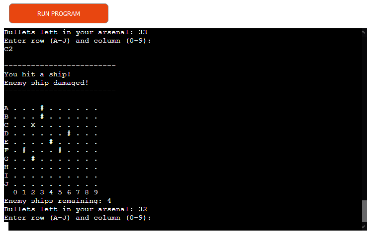

# Complete Annihilation

Complete Annihilation is a game about finding all enemy ships before you run out of bullets. All enemy ships are randomly placed at the start of the game, and each ship is of a randomly chosen size. The ships are hidden and it is up to the player to guess their position by entering a set of coordinates. The player fires a bullet after each guess.

The game is a Python terminal game and is played in a mock terminal on Heroku created by Code Institiute.

A live version of the project can be found [here](https://complete-annihilation.herokuapp.com/).

## How to play

Each game starts by generating a grid and populating it with four enemy ships. The player is given 40 bullets and must sink all enemy ships before he or she runs out of bullets. The size of the ships is randomly chosen by the computer, and a ship will not be destroyed until all parts of the ship have been hit by a bullet. To guess the position of a ship, and fire a bullet, the player must enter a set of coordinates. The coordinates must consist of one alphabetical letter between A and J as well as a number between 0 and 9. 

The player wins when all enemy ships have been destroyed, and the game is lost when the player runs out of bullets.

Each possible coordinate is represented by a '.' on the grid, and each enemy ship is represented by a 'O' which is hidden to the player. When the player shoots a bullet the chosen coordinate will be marked by either a '#', which represents a miss, or an 'X', which represents a part of a ship that was hit.

The game ends when either all ships are sunk or the player runs out of bullets.

## Features

### Existing Features

* Random game grid generation
  - Ship position and ship size is randomly chosen by the computer
  - All enemy ships are hidden from the player

* Keeps track of the number of bullets and enemy ships remaining
  - Informs the player whether he or she has lost or won

* Accepts player input
  - Each player input is validated
  - Coordinates outside the grid are not allowed
  - Player is not allowed to attack the same position twice
  - Only coordinates consisting of one letter between A and J and a number between 0 and 9 are accepted

* Informs the player whether an attack was a miss, a hit or if an enemy ship was completely destroyed

### Future Features

* Ability to play against other players

* Add a player grid with ships that the computer can attack

* Score board

## Data Model

The data model for this project is simply a collection of functions that work together to create the game. Each function uses one or several global variables, and each one performs a unique function that is sometimes dependent on a previously created function. The final function that runs the game ties them all together.

## Testing

The project has been manually tested by doing the following:

* Running the code through Code Institute's Python linter

* Running the game both in my local terminal and in the Code Institute Heroku terminal
  - Played multiple game sessions
  - Gave both valid and invalid inputs to test game's response

### Bugs

### Remaining Bugs

* There are no remaining bugs.

### Validator Testing

* No errors were returned when passing the code through Code Institute's Python validator.

## Deployment
  1. Head to Heroku and click on the "New" tab and select "Create new app"
  2. Choose a unique name for the app and click "Create app"
  3. Click on the "Settings" tab and then head down to the "Config vars" section
  4. Click "Reveal Config Vars" and add a Config Var called "PORT" (key) with a value of "8000" (value)
  5. Head down to the "Buildpacks" section and click "Add buildpack"
  6. Choose "Python" save the changes
  7. Add a second buildpack called "nodejs"
  8. Click the "Deploy" tab and go down to the "Deployment method" section
  9. Choose "GitHub" and then search for the project name chosen on GitHub
  10. Click the "Connect" button when the project has been found
  11. Choose either "Enable Automatic Deploys" in the "Automatic deploys" section or "Deploy Branch" in the "Manual Deploy" section

  ## Credits

  * Code Institute for the deployment terminal